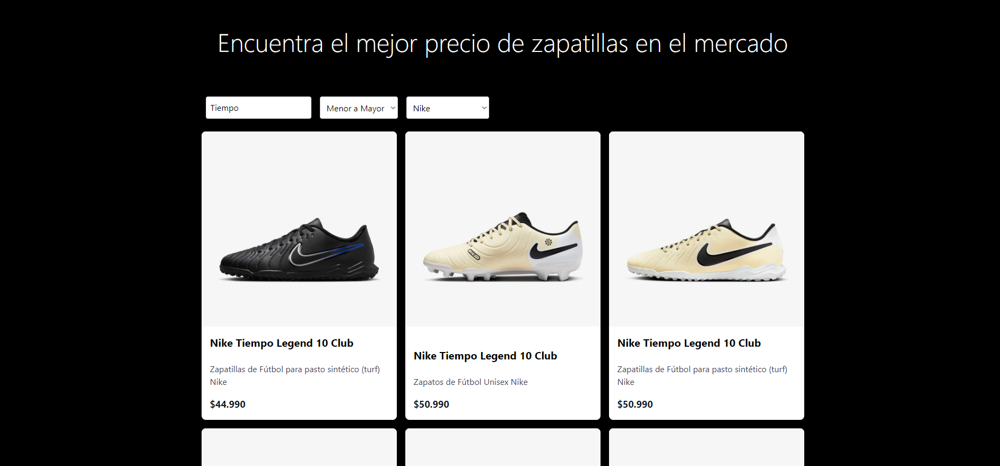

# Proyecto de Web Scraping para Zapatillas de Fútbol

Este proyecto está diseñado para facilitar la búsqueda de las mejores ofertas en zapatillas de fútbol. Utilizando técnicas avanzadas de web scraping, el sistema recopila datos de tiendas en línea especializadas en este tipo de calzado. El scraping extrae información detallada sobre las zapatillas, incluyendo nombres, precios y marcas.

## Tecnologías Utilizadas

- **Web Scraping**: Para extraer información de tiendas en línea.
- **Astro**: Framework utilizado para consumir los archivos JSON generados por el proceso de scraping y mostrar la información en una interfaz web.

## Funcionalidades

- **Buscador**: Permite a los usuarios encontrar zapatillas específicas.
- **Filtros**: Los usuarios pueden filtrar los resultados por tipo de marca y rango de precio.

## Interfaz

Con esta solución, se ofrece una herramienta práctica y accesible para comparar precios y encontrar las mejores ofertas en zapatillas de fútbol de diferentes marcas y estilos.
